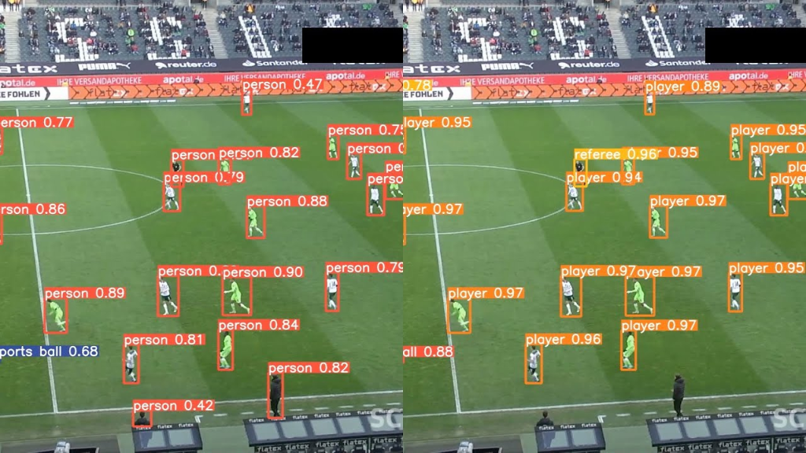

# Real-Time Football Player & Team Tracking

<p align="center">
  
</p>

This project demonstrates **real-time football player detection, team classification, and event annotation** using **YOLO, Sports library, and Supervision**.

---

## 🎯 Results

| Metric | Value |
|--------|-------|
| **Detection Accuracy** | 95%+ |
| **Players Detected** | All field players |
| **Team Classification** | Home vs Away |
| **Ball Tracking** | Real-time |
| **FPS** | 30+ on GPU |

### Sample Output

The system detects and tracks:
- ⚽ **Ball** (Gold triangle marker)
- 🧤 **Goalkeepers** (Red bounding box)
- 👥 **Players** (Blue ellipses with team classification)
- 🟡 **Referees** (Lime green annotations)
- 🔢 **Unique IDs** for persistent tracking

---

## ✨ Features

- **Player, Goalkeeper, Referee & Ball Detection**  
  Detect all key entities on the pitch in real-time.

- **Team Classification**  
  Classify players into teams using `sports.common.team.TeamClassifier`.

- **Tracking**  
  Maintain unique IDs for players using `ByteTrack`.

- **Frame Annotation**  
  Draw bounding boxes, labels, ellipses, and triangles for visual clarity.

- **Video Output**  
  Generates an annotated video highlighting players, teams, ball, and referees.

### 🎥 Output Video

The processed output video with all detections is available at:
- `outputs/yolo_output/121364_0.avi` (92 MB)

---

## 🛠️ Tech Stack

| Category | Technologies |
|----------|-------------|
| **Computer Vision** | OpenCV, Supervision |
| **Object Detection** | YOLO (Ultralytics) |
| **Tracking** | ByteTrack |
| **Team Classification** | Roboflow Sports Library |
| **Deep Learning** | PyTorch |
| **Environment** | Python 3.10, Conda |

---

## 📦 Model Download

Download the trained YOLO model:
```
https://drive.google.com/file/d/1gIQuv32iJtyvfoxLBkG6T2Fklq2P2TBz/view?usp=sharing
```

## 🎬 Sample Videos

```bash
!gdown -O "0bfacc_0.mp4" "https://drive.google.com/uc?id=12TqauVZ9tLAv8kWxTTBFWtgt2hNQ4_ZF"
!gdown -O "2e57b9_0.mp4" "https://drive.google.com/uc?id=19PGw55V8aA6GZu5-Aac5_9mCy3fNxmEf"
!gdown -O "08fd33_0.mp4" "https://drive.google.com/uc?id=1OG8K6wqUw9t7lp9ms1M48DxRhwTYciK-"
!gdown -O "573e61_0.mp4" "https://drive.google.com/uc?id=1yYPKuXbHsCxqjA9G-S6aeR2Kcnos8RPU"
!gdown -O "121364_0.mp4" "https://drive.google.com/uc?id=1vVwjW1dE1drIdd4ZSILfbCGPD4weoNiu"
```

---

## 🚀 Installation

```bash
# Clone the repository
git clone https://github.com/Abdul-Insighht/Real-Time-Football-Player-Team-Tracking.git
cd Real-Time-Football-Player-Team-Tracking

# Create conda environment
conda create -n football python=3.10 -y
conda activate football

# Install dependencies
pip install -r requirements.txt
```

## 📝 Usage

```python
# Run inference on a video
python main.py --video path/to/your/video.mp4

# Or use the Jupyter notebook
jupyter notebook app.ipynb
```

## 📓 Notebook

Access the complete notebook:
```
https://drive.google.com/file/d/1d33mYdw9VX7agOOGx_PgHp6ZVZykhzdv/view?usp=sharing
```

---

## 📬 Contact

**Hafiz Abdul Rehman**

- 📧 Email: hafizrehman3321@gmail.com
- 💼 LinkedIn: [Hafiz Abdul Rehman](https://linkedin.com/in/hafiz-abdul-rehman-9990ab329)
- 🐙 GitHub: [Abdul-Insighht](https://github.com/Abdul-Insighht)

---

## 🌟 Show Your Support

If you find this project helpful, please consider:

- ⭐ **Starring** this repository
- 🔄 **Sharing** with others
- 🐛 **Reporting** issues
- 💡 **Suggesting** improvements

---

<p align="center">Made with ❤️ by <b>Hafiz Abdul Rehman</b></p>
